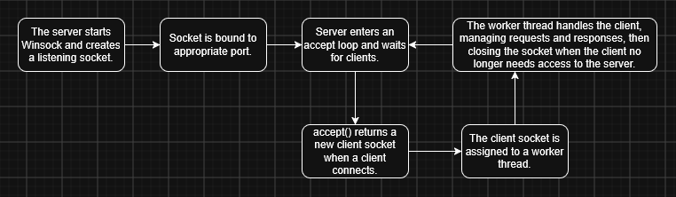

# Multithreaded HTTP Server

This is an HTTP server written in C++ using Winsock and a custom thread pool.

## Program Flow

  

## How to Run

### Option 1 - Visual Studio

Open the project solution in Visual Studio and run it.
You can test it in a browser by visiting `http://localhost:8080/`

### Option 2 - CMake

From the project root, open Developer PowerShell and run:  
`cmake -S . -B build`  
`cmake --build build`  
Then start the server:  
`.\build\Debug\multithreaded_server.exe`

### Stress Test

Start the server first. Then, in a second terminal from the project root, run:  
`python test/stress_test.py`

Requires Python 3.9+ and no extra packages.

Options:

- `--waves` - number of request waves (default: 10)
- `--requests` - concurrent requests per wave (default: 50)
- `--url` - target URL (default: `http://127.0.0.1:8080/`)
- `--timeout` - per-request timeout in seconds (default: 10)

Example with heavier load:  
`python test/stress_test.py --waves 20 --requests 200`

The script reports each wave's result counts, average / p95 / max latency, and throughput, followed by an overall success rate. A successful stress test should show every request returning SUCCESS.

> **Note:** On Windows, `localhost` can resolve to IPv6 (`::1`) first. If the server only listens on IPv4, each request waits ~2 seconds before falling back. The test defaults to `127.0.0.1` to avoid this.

To save the results to a file:  
`python test/stress_test.py > test/stress-test-output.txt`

## Overview

- Creates a TCP listening socket with Winsock
- Accepts multiple client connections
- Handles each client request through a worker thread
- Parses basic HTTP GET requests
- Serves a static `index.html` file from `public/`
- Returns simple `404 Not Found` and `405 Method Not Allowed` responses
- Includes a Python stress test for concurrent requests, along with saved results from a test run in `test/`

## Design

This project is organized around a simple multithreaded HTTP server architecture.

### High-Level Flow

1. The server starts Winsock and creates a listening socket.
2. The socket is bound to port `8080`.
3. The server enters an accept loop and waits for clients.
4. When a client connects, `accept()` returns a new client socket.
5. The client socket is placed into a thread pool as a task.
6. A worker thread handles the client by:
   - receiving the raw HTTP request
   - parsing the request into an `HTTPRequest` object
   - routing the request
   - building an `HTTPResponse`
   - sending the response back to the client
   - closing the client socket

### Main Components

- **Server.cpp** - Initializes Winsock, creates the listening socket, binds, listens, accepts clients, and submits client work to the thread pool.
- **ThreadPool.cpp** - Maintains a fixed number of worker threads and a queue of client-handling tasks.
- **ClientHandler.cpp** - Handles one connected client socket by receiving the request, calling the router, sending the response, and closing the connection.
- **HTTPRequest.cpp** - Represents a parsed HTTP request, including method, path, version, headers, and body.
- **HTTPResponse.cpp** - Builds a valid HTTP response string with status line, headers, and body.
- **Router.cpp** - Decides how to respond based on the request method and path.
- **StaticFileHandler.cpp** - Reads files from the `public/` folder and returns them as HTTP responses.
- **test/stress_test.py** - Python load-testing script that sends waves of concurrent requests and reports success rate, latency, and throughput.

## Concurrency Model

The server uses a fixed-size thread pool instead of creating a new thread for every client.

When a client connects, the main server thread accepts the connection and adds a task to the thread pool. One of the available worker threads then handles that client connection.

This allows multiple clients to be handled concurrently while avoiding the overhead of creating and destroying a thread for every request.